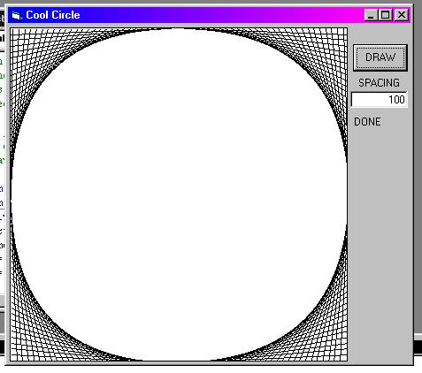



## Drawing a circle using lines

### Description

the purpose of this code is just to make a circle by using lines of different gradients
 
### More Info
 
the user just needs to understand a bit about graphing, (eg coordinates)

             |
---                |---
**Submitted On**   |2002-04-21 14:54:46
**By**             |[eagle4](https://github.com/Planet-Source-Code/PSCIndex/blob/master/ByAuthor/eagle4.md)
**Level**          |Beginner
**User Rating**    |5.0 (10 globes from 2 users)
**Compatibility**  |VB 6\.0
**Category**       |[Graphics](https://github.com/Planet-Source-Code/PSCIndex/blob/master/ByCategory/graphics__1-46.md)
**World**          |[Visual Basic](https://github.com/Planet-Source-Code/PSCIndex/blob/master/ByWorld/visual-basic.md)
**Archive File**   |[Drawing\_a\_741464212002\.zip](https://github.com/Planet-Source-Code/eagle4-drawing-a-circle-using-lines__1-33995/archive/master.zip)

